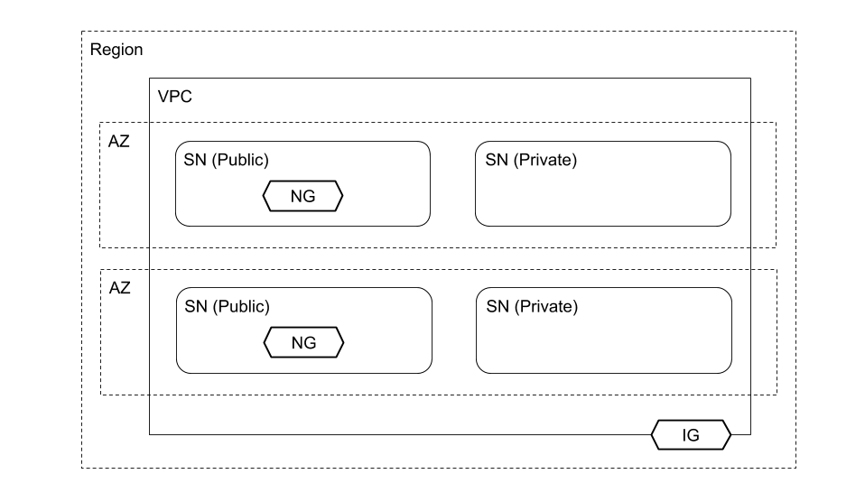
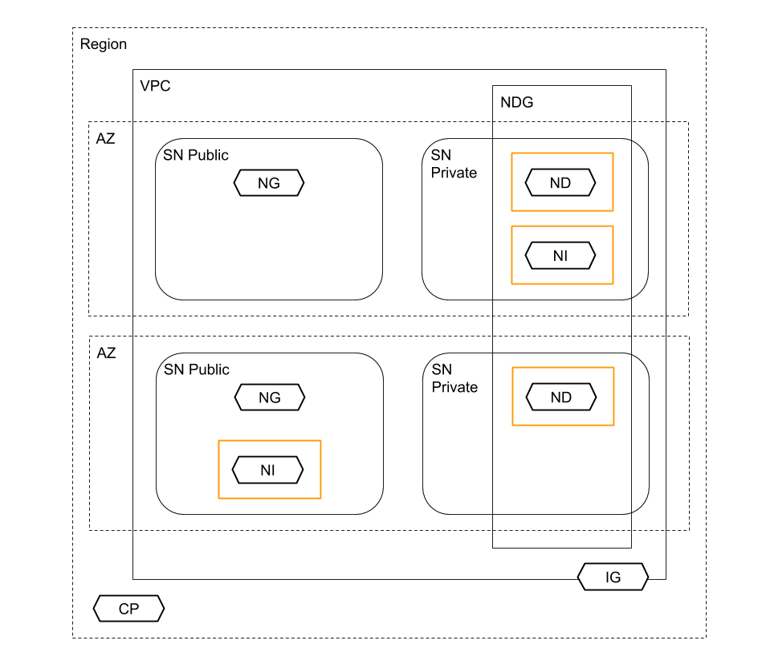

# Under the Hood

## Amazon Virtual Private Cloud (VPC)

The Amazon infrastructure includes:

* Region

* Availability Zone (AZ) x 2

The VPC infrastructure includes:

* VPC: 172.16.0.0/16

* Subnet (SN) Private: 172.16.128.0/18

* Subnet (SN) Private: 172.16.192.0/18

* Subnet (SN) Public: 172.16.0.0/24

* Subnet (SN) Public: 172.16.1.0/24

* Internet Gateway (IG)

* NAT Gateway (NG) x 2

The VPC infrastructure also includes:

* Route Table Private x 2 (associated with subnet private)

| Destination   | Target |
| ------------- | ------ |
| 172.16.0.0/16 | local  |
| 0.0.0.0/0     | NG     |

* Route Table Public (associated with subnet public x 2)

| Destination   | Target |
| ------------- | ------ |
| 172.16.0.0/16 | local  |
| 0.0.0.0/0     | IG     |

* Network Access Control List (associated with subnet private x 2 and subnet public x 2):

Inbound:

| Rule | Type        | Source      | Allow/Deny |
| ---- | ----------- | ----------- | ---------- |
| 100  | All Traffic | 0.0.0.0/0   | ALLOW      |
| *    | All Traffic | 0.0.0.0/0   | DENY       |

Outbound:

| Rule | Type        | Destination | Allow/Deny |
| ---- | ----------- | ----------- | ---------- |
| 100  | All Traffic | 0.0.0.0/0   | ALLOW      |
| *    | All Traffic | 0.0.0.0/0   | DENY       |

## Amazon Elastic Kubernetes Service (EKS)

The cluster infrastructure includes:

* EKS Kubernetes Control Plane (CP)

* Node Group (NG); backed by an EC2 auto scaling group and EC2 launch template

* Nodes (ND); the managed EC2 instances provided by the node group

* Network Interfaces (NI); in addition to the network interfaces associated with the EC2 instances there are two addition network interfaces. Based on the security group configuration (below), these network interfaces appear to enable the control plane to communicate with the nodes

**note**: One of the two additional network interfaces appeared in a public subnet; not sure why.

* Security Group (orange); EKS creates a security group:

Inbound:

| Type        | Source    |
| ----------- | --------- |
| All Traffic | orange SG |

Outbound:

| Type        | Destination |
| ----------- | ----------- |
| All Traffic | 0.0.0.0/0   |

The cluster infrastructure also includes:

* Cluster IAM Role; provides EKS permissions

* Node Instance IAM Role; provides Nodes permissions

* IAM OpenID Connect Identify Provider; enables IAM roles for service accounts

## Continuous Integration (without Workloads)

The continuous integration infrastructure includes:

* S3 Bucket (BK); storing CodePipeline artifacts

## ALB Ingress Controller (without Workloads)

The ALB Ingress controller includes [alb-ingress-controller resources](https://registry.terraform.io/modules/iplabs/alb-ingress-controller/kubernetes/3.0.2?tab=resources).

## AWS Auth ConfigMap

Elastic Kubernetes Service (EKS) creates a ConfigMap, *aws-auth*, in the *kube-system* namespace.

[Managing users or IAM roles for your cluster](https://docs.aws.amazon.com/eks/latest/userguide/add-user-role.html)

## Continuous Integration (with Workloads)

TODO

## ALB Ingress Controller (with Workloads)

TODO

## Workloads

TODO
